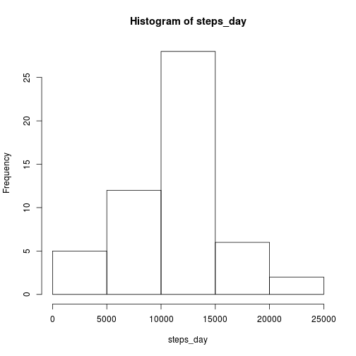

<h2>Loading the data</h2>


```r
data <- read.csv("activity.csv")
data$date <- as.POSIXct(data$date, "%Y-%m-%d")
```

<h2>Mean total number of steps taken each day</h2>
<p>1. Histogram of the mean total number of steps taken each day</p>


```r
steps_day <- with(data, sapply(split(steps, date), sum))
hist(steps_day)
```

 
<p>2. Mean and median of total number of steps taken perday </p>

```r
mean_with_NA <- mean(steps_day, na.rm = TRUE)
mean_with_NA
```

```
## [1] 10766.19
```

```r
median_with_NA <- median(steps_day, na.rm = TRUE)
median_with_NA
```

```
## [1] 10765
```

<h2>Average daily activity pattern</h2>
<p>1. Time series plot</p>

```r
steps_by_interval <- with(data, sapply(split(steps, interval), mean, na.rm=TRUE))
plot(steps_by_interval, type="l")
abline(h=max(steps_by_interval), col="blue")
abline(h=mean(steps_by_interval), col="green")
abline(h=median(steps_by_interval), col="orange")
```

 
<p>2. The 5-minute interval, on average across all the days all the days in the dataset, that contains the maximum number of steps</p>


```r
max_idx <- which(steps_by_interval == max(steps_by_interval)) 
```

<p>The interval</p>

```r
names(steps_by_interval[max_idx])
```

```
## [1] "835"
```
<p>The max value</p>

```r
steps_by_interval[max_idx]
```

```
##      835 
## 206.1698
```


<h2>Imputing missing values</h2>
<p>1. Total number of missing values in the dataset</p>

```r
nrow(data)-sum(complete.cases(data))
```

```
## [1] 2304
```

<p>2. Filling in all of the missing values</p>


```r
as.integer(0)
```

```
## [1] 0
```

<p>3. Creating a new dataset that is equal to the original but with the missing data filled in</p>


```r
nds <- data
nds$steps[is.na(data$steps)] <- as.integer(0)
```

<p>4. Histogram of the total number of steps taken each day</p>


```r
new_steps_day <- with(nds, sapply(split(steps, date), sum))
hist(new_steps_day)
```

 
<p> The mean and median total number of teps taken per day</p>


```r
mean_filled <- mean(new_steps_day)
mean_filled
```

```
## [1] 9354.23
```

```r
median_filled <- median(new_steps_day)
median_filled
```

```
## [1] 10395
```

<p>Do these values differ from the estimates from the first part?</p>

```r
!(mean_with_NA==mean_filled)
```

```
## [1] TRUE
```

```r
!(median_with_NA==median_filled)
```

```
## [1] TRUE
```

<h2>Differences in activity patterns between weekdays and weekends</h2>

<p>1. Creating a new factor variable with two levels -- "weekday" and "weekend" indicating whether a given date is a weekday or weekend day</p>

```r
day_type_idx <- weekdays(nds$date) %in% c("Sunday", "Saturday")
summary(day_type_idx)
```

```
##    Mode   FALSE    TRUE    NA's 
## logical   12960    4608       0
```

```r
day_type <- day_type_idx
day_type[day_type_idx] <- "weekend"
day_type[!day_type_idx] <- "weekday"
day_type <- as.factor(day_type)
nds$day_type <- day_type
```

<p>2. Panel plot containing a time series plot of the 5-minute interval (x-axis) and the average number of steps taken, averaged across all weekday days or weekend days (y-days).</p>


```r
library(ggplot2)
qplot(interval, steps,  data=nds, color=day_type, geom="line", facets=day_type ~., stat="summary", fun.y ="mean")
```

 
